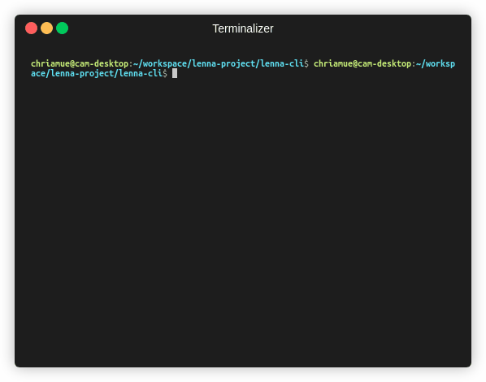

# lenna-cli

Lenna is a library for image processing algorithms and apps.

This is the Command Line Interface for Lenna.

## 🐰 quickstart

```bash
cargo build
```

## ✂️ copy plugins

Here are some [plugins](https://github.com/lenna-project/lenna-plugins).
After the plugins are built, they can be copied and used with lenne-cli.

```bash
mkdir plugins
cp ../lenna-plugins/target/release/lib*.so plugins/
```

## 🔧 config

Create a file called lenna.yml.

```yaml
pipeline:
  - id: resize
    width: 500
    height: 500
  - id: canny
    low: 50.0
    high: 100.0
  - id: blur
    sigma: 1.5
```

Id is the plugin, the other attributes are the parameter for the plugin.

## 👻 run

```bash
cargo run -- lenna.png -o lenna_out.png -c lenna.yml -p plugins/
```



## Install

Install using snapcraft.

```bash
snapcraft
sudo snap install lenna-cli_*.snap --devmode --dangerous
lenna-cli --help
lenna-cli lenna.png --config lenna.yml --output out.png --plugins /snap/lenna-cli/current/plugins
```

## 📜 License

This software is licensed under the [MIT](https://github.com/lenna-project/lenna-cli/blob/main/LICENSE) © [lenna-project](https://github.com/lenna-project).
